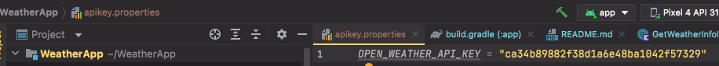
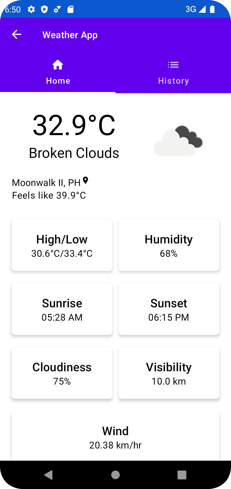
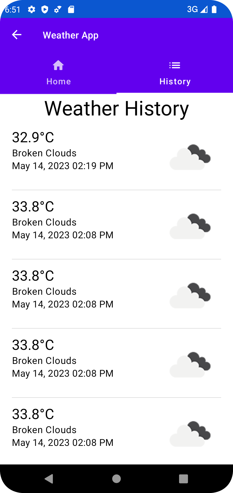

# Weather Application

An android Weather Application that uses android MVVM clean architecture using Kotlin

### How to enable the API https://api.openweathermap.org/ to your application

- Since we cannot expose the api token to our github repo, I implemented a apikey.properties file which will hold the api key and this copy is only available to your local machine.
- Create a file from the root project named **apikey.properties**
- After creating **apikey.properties**, please put variable and value of your openweathermap api and name the variable this **OPEN_WEATHER_API_KEY = ""**"
- Clean project and build. If you encounter compilation error, it means that you didn't created the property file or variable name is incorrect.
- How did I load the property file can be seen in **app/build.gradle**
- You can access the api key by accessing BuildConfig.OPEN_WEATHER_API_KEY
#### Check screenshot

### Features:

- Tab for current weather
- Tab for weather history fetched
- Unit test

### Technologies Used:

- SOLID Principle (Clean architecture: Domain-Data-Presentation layer)
- Kotlin as programming language
- MVVM Architecure (Model-View-ViewModel)
- Coroutines: for async task
- Retrofit: HTTP Client request

### Jetpack Components:

- Room: a database for storing history of weather.
- Compose pager: for Horizontal pager of tab
- Jetpack compose: a declarative way of writing UI instead of XML.
- Dagger Hilt: a dependency injection library
- Koil: a library for image loader

### Unit test:

- JUnit 4
- Mockk: a library for mocking and stubbing data to your unit test

### Example Screen:

